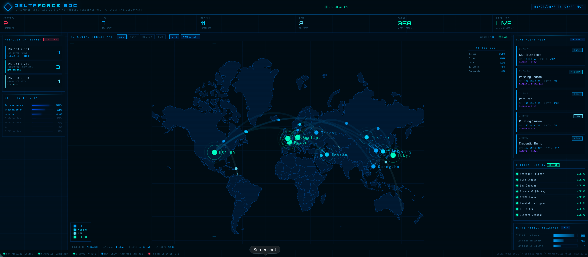

# Roman Mares — Cybersecurity Engineer & AI SOC Builder

---

## Delta Force AI SOC Platform

> AI-powered Security Operations Center with real-time global threat intelligence, MITRE ATT&CK mapping, automated escalation, and live Discord alerting.

**This is not a tutorial project. This is a working pipeline.**

🌐 **Live Dashboard:** https://romanm24.github.io/deltaforce-soc-ai

---

## Tech Stack

| Layer | Tools |
|-------|-------|
| AI Analysis | Claude AI (Anthropic) |
| Automation | n8n workflows |
| Threat Map | D3.js + TopoJSON |
| Alerting | Discord webhooks |
| Agents | VS Code + Claude Code |
| Languages | Python, JavaScript |

---

## Currently Building

- AI-powered SOC pipeline — Claude AI + n8n automation
- Campus cyber lab pilot deployment
- Real-time threat intelligence dashboard
- Automated MITRE ATT&CK classification

---

## Repos

| Project | Description |
|---------|-------------|
| [deltaforce-soc-ai](https://github.com/Romanm24/deltaforce-soc-ai) | Main SOC platform |
| [soc-command-center](https://github.com/Romanm24/soc-command-center) | Agent system + automation |

---

## Contact

📧 Roman.mares2012@gmail.com
